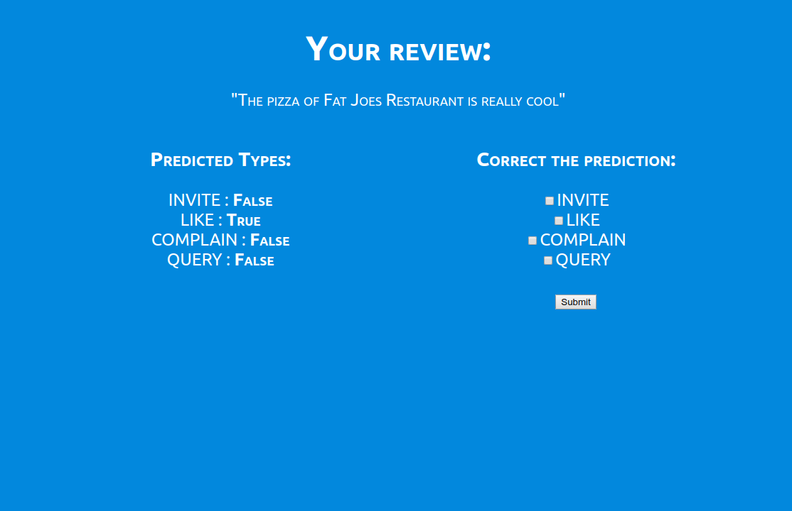

# Sentiment Analysis
A machine learning based application to predict the sentiment of a text/comment. The architecture uses Word2Vec for embeddings and SVM as base model. Instead of prediciting only positive/negative sentiment of a text, the model predicts four classes (like, invite, complain, query) as one sentence can contain multiple meaning.




## Getting Started
This is a Flask based web application. Install the dependencies by running the following command:
```
pip install -r requirements.txt 
```
Run the application by running:
```
python app.py
```
